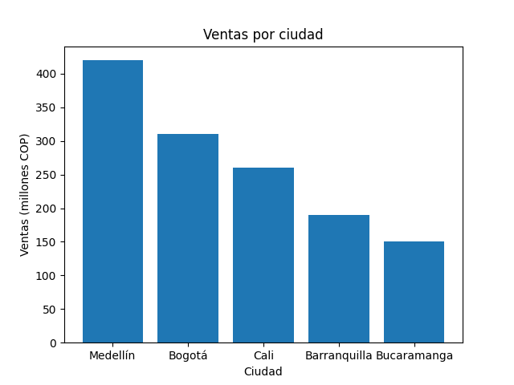
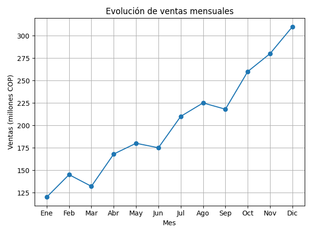
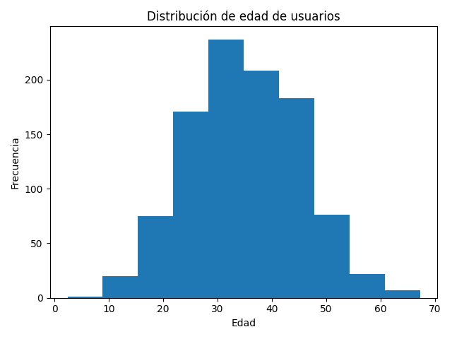
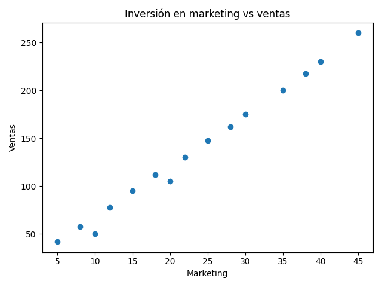
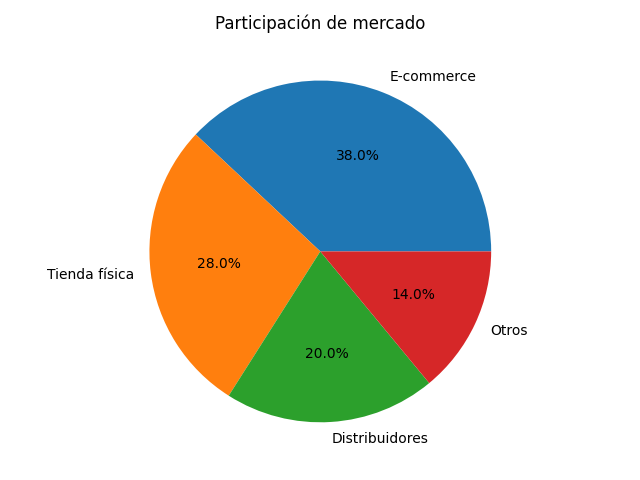

# Herramientas de visualización de datos
**Análisis de Datos**

---

## Tema 1: Introducción a herramientas de visualización de datos

### ¿Por qué visualizar datos?

El análisis de datos no termina cuando obtienes un resultado. Termina cuando ese resultado se convierte en una **decisión**.

> *"Los datos en bruto no están diseñados para ser interpretados rápidamente."*

Imagina que tienes un dataset perfectamente limpio, consultas SQL optimizadas y análisis bien estructurados. Pero cuando alguien del negocio te pregunta *¿cómo van las ventas?*, tú respondes con tablas y números. Lo más probable es que esa persona no entienda — no porque no sea inteligente, sino porque los datos sin contexto no comunican.

**Aquí es donde aparece la visualización de datos.**

---

### ¿Qué es realmente la visualización de datos?

Muchos piensan que visualizar datos es *"hacer gráficos"*. Pero eso es una simplificación peligrosa.

> **La visualización de datos es el proceso de transformar información compleja en algo que pueda ser entendido rápidamente por una persona.**

No se trata de estética. Se trata de:

- **Claridad** — que el mensaje sea directo
- **Interpretación** — que cualquier persona pueda entenderlo
- **Toma de decisiones** — que alguien pueda actuar con base en lo que ve

---

### El flujo completo del analista

Todo lo que trabajaste en semanas anteriores tiene un propósito claro en este punto:

| Etapa | Lo que hiciste | Por qué importa |
|---|---|---|
| **EDA** | Exploración de datos | Entendiste la estructura y el contexto |
| **Limpieza** | Transformación y calidad | Aseguraste que los datos son confiables |
| **SQL** | Consultas estructuradas | Extrajiste información relevante |
| **Visualización** | Comunicación visual | Conviertes datos en decisiones |

---

### ¿Qué es una herramienta de BI?

Las herramientas de **Business Intelligence (BI)** no reemplazan Python o SQL. Existen para **complementar** todo lo que hiciste antes.

Una herramienta de BI permite:
- Conectar múltiples fuentes de datos
- Transformar información sin escribir código
- Crear visualizaciones interactivas
- Construir dashboards para usuarios de negocio

**Lo más importante:** permite que otras personas interactúen con los datos sin necesidad de saber código.

#### Herramientas más usadas en la industria

| Herramienta | Empresa | Fortaleza |
|---|---|---|
| **Power BI** | Microsoft | Integración con Azure y Office |
| **Tableau** | Salesforce | Análisis visual avanzado |
| **Looker** | Google | Modelado semántico en la nube |
| **Qlik** | Qlik | Motor asociativo libre |

---

### El cambio de rol: de técnico a comunicador

Hasta ahora tu foco fue técnico. Ahora aparece una nueva dimensión:

**→ Cómo comunicar lo que encontraste**

Esto implica desarrollar habilidades nuevas:
- Entender qué información es relevante para el negocio
- Saber qué mostrar y qué omitir
- Estructurar información de forma que guíe al usuario
- Pensar en quién va a consumir el análisis

---

### ¿Qué hace realmente un dashboard?

Un dashboard **no es** una colección de gráficos. Es una **herramienta diseñada para responder preguntas concretas**.

Un buen dashboard permite identificar tres cosas fundamentales:

1. **¿Qué está pasando?** — Descripción del estado actual
2. **¿Por qué está pasando?** — Análisis de causas
3. **¿Qué debería hacerse?** — Orientación hacia una acción

> Un mal dashboard no necesariamente carece de datos, sino que **carece de enfoque**.

---

### Errores comunes en visualización

- Intentar mostrar demasiada información al mismo tiempo (sobrecarga cognitiva)
- Utilizar gráficos incorrectos para el tipo de dato que se quiere mostrar
- Priorizar el diseño sobre la claridad
- Diseñar desde la perspectiva del analista, no del usuario final

---

### Conclusiones del Tema 1

El análisis de datos no es un proceso aislado, sino una cadena de valor. Las herramientas de visualización no son el objetivo final — son un **medio para comunicar** lo que ya construiste. Tu rol evoluciona: ya no eres solo alguien que manipula datos, sino alguien que **conecta información con decisiones**.

---
---

## Tema 2: Storytelling con datos

### ¿Por qué los datos no hablan por sí solos?

Un análisis técnicamente perfecto, con datos bien estructurados y métricas correctas, puede no generar ningún impacto.

¿Por qué? **Porque nadie entendió lo que quisiste mostrar.**

Los datos son representaciones de la realidad, pero no explican por sí mismos qué significan ni por qué son importantes. Un gráfico puede mostrar una tendencia, pero no explica qué la causa ni qué implica.

> **No basta con analizar datos, necesitas saber cómo contarlos.**

---

### Análisis vs. Comunicación

Son habilidades distintas que se complementan:

| Análisis | Comunicación |
|---|---|
| Encontrar patrones en los datos | Transmitir hallazgos con claridad |
| Construir métricas y KPIs | Ordenar la información lógicamente |
| Validar información | Pensar en el usuario final |
| Responder una pregunta técnica | Guiar hacia una decisión |

---

### ¿Qué es el storytelling con datos?

El storytelling con datos **no consiste en adornar** la información ni en hacer presentaciones bonitas sin propósito. Se trata de estructurar los datos de manera que cuenten una historia coherente.

> **El storytelling es una forma de pensar el análisis, no solo de presentarlo.**

En el contexto profesional, es lo que permite que un análisis pase de ser información técnica a convertirse en una **herramienta para la toma de decisiones**.

---

### Estructura de una historia con datos

Para que una narrativa con datos funcione, debe seguir esta estructura:

INTRODUCCIÓN   →  Presenta el contexto y el problema

ANÁLISIS       →  Muestra datos y hallazgos clave

INSIGHTS       →  Revela las conclusiones importantes

SOLUCIÓN       →  Propone acciones y recomendaciones

DESENLACE      →  Conclusión y llamado a la acción

Esta secuencia responde a la forma en que las personas procesan la información: primero entienden el problema, luego analizan la evidencia, finalmente llegan a una conclusión.

---

### Tipos de preguntas de negocio

El storytelling depende del tipo de pregunta que estás respondiendo:

| Tipo | Pregunta | Foco |
|---|---|---|
| **Descriptiva** | ¿Qué está pasando? | Estado actual |
| **Diagnóstica** | ¿Por qué está pasando? | Causas y factores |
| **Predictiva** | ¿Qué podría pasar? | Comportamientos futuros |

---

### ¿Cómo guiar al usuario dentro de un dashboard?

Un dashboard no debe ser un espacio donde la persona tenga que descubrir sola qué está pasando. Debe llevarla **naturalmente hacia una comprensión clara**.

Guiar al usuario significa:
- Decidir qué información aparece primero
- Destacar los elementos más importantes
- Conectar las métricas entre sí
- Evitar distracciones visuales

---

### Errores comunes en storytelling

- Mostrar todo el análisis en lugar de enfocarse en lo relevante
- No tener un objetivo claro (narrativas dispersas)
- Presentar datos sin conexión entre sí
- Falta de contexto que aísla los datos

---

### Conclusiones del Tema 2

El análisis no termina cuando obtienes resultados — termina cuando esos resultados son **comprendidos por otras personas**. El storytelling estructura la información de manera que tenga sentido y dirección. No se trata de mostrar todo lo que sabes, sino de **comunicar lo que realmente importa**.

---
---

## Tema 3: Construcción de dashboards y visualización efectiva

### De dataset analítico a dashboard

El punto de partida de cualquier dashboard no es la herramienta — es el **dataset analítico** que construiste previamente. La visualización es solo una capa que se construye sobre esa base.

> **Un dashboard no corrige problemas de datos.** Si el dataset está mal estructurado, el dashboard simplemente hará visibles esos errores.

---

### Tipos de gráficos y su propósito

Elegir el tipo de gráfico correcto es una decisión conceptual, no estética. Cada gráfico comunica un tipo específico de relación:

---

#### Gráfico de barras — Comparación entre categorías

**Cuándo usarlo:** Cuando necesitas comparar valores entre diferentes grupos.

- Es el más claro para responder *"¿cuál es mayor?"*
- El cerebro humano interpreta longitudes fácilmente
- Ideal con un número moderado de categorías

**Ejemplos:** Ventas por ciudad · Ingresos por producto · Clientes por segmento

---

#### Gráfico de líneas — Tendencias en el tiempo

**Cuándo usarlo:** Cuando quieres analizar cómo cambia una variable a lo largo del tiempo.

- Permite ver tendencias, crecimiento, caídas o patrones repetitivos
- Funciona mejor con secuencia temporal clara (días, meses, años)

**Ejemplos:** Ventas mensuales · Usuarios activos por día · Evolución de ingresos

---

#### Histograma — Distribución de datos

**Cuándo usarlo:** Para entender cómo se distribuyen los valores en un conjunto.

- Agrupa datos en rangos y muestra dónde se concentra la mayoría
- Permite detectar concentración, dispersión o valores atípicos
- Clave en el análisis exploratorio (EDA)

**Ejemplos:** Distribución de ingresos · Tiempo de entrega de pedidos · Edad de usuarios

---

#### Gráfico de dispersión — Relación entre variables

**Cuándo usarlo:** Para analizar la relación entre dos variables numéricas.

- Permite identificar correlaciones, patrones o comportamientos atípicos
- No muestra categorías ni tiempo — muestra **relaciones**

**Ejemplos:** Inversión en marketing vs ventas · Edad vs ingreso · Tiempo en plataforma vs retención

---

#### Gráfico de pastel — Proporción dentro de un todo

**Cuándo usarlo:** Para mostrar cómo se distribuye un total entre diferentes partes.

- Funciona bien con pocas categorías y diferencias claras
- **No recomendable** con muchas categorías o valores similares

**Ejemplos:** Participación de mercado · Ventas por canal · Distribución de clientes por tipo

---

### Resumen: ¿qué gráfico usar?

| Pregunta de negocio | Gráfico recomendado |
|---|---|
| ¿Cuál ciudad vendió más? | Barras |
| ¿Cómo evolucionaron las ventas? | Líneas |
| ¿Cómo se distribuyen los ingresos? | Histograma |
| ¿Afecta el marketing a las ventas? | Dispersión |
| ¿Qué % representa cada región? | Pastel |

---

### Construcción de un dashboard

Construir un dashboard implica organizar la información con **lógica y jerarquía definida**.

- Los elementos más importantes deben ser los más visibles
- Los detalles se ubican en un segundo nivel
- La disposición de los gráficos debe guiar la lectura naturalmente
- Un dashboard bien estructurado no necesita explicaciones adicionales

---

### Interactividad y exploración

A diferencia de un reporte estático, un dashboard permite que el usuario **explore los datos, filtre información y profundice** según sus necesidades.

La interactividad debe diseñarse con intención:
- Demasiadas opciones generan confusión
- Muy pocas limitan la utilidad
- El equilibrio está en complementar la narrativa, no complicarla

---

### Buenas prácticas en visualización

- Mantener **consistencia** en colores, formatos y estructuras
- Evitar elementos innecesarios — la **simplicidad** es clave
- Priorizar la legibilidad sobre la creatividad visual
- Pensar siempre en el usuario final, no en el analista

---

### Validación del dashboard

Antes de publicar un dashboard, hazte estas preguntas:

- ¿Responde realmente las preguntas que motivaron el análisis?
- ¿Puede el usuario entender la información sin explicación adicional?
- ¿Puede identificar rápidamente lo importante?
- ¿Puede tomar una decisión con base en lo que ve?

---

### Conclusiones del Tema 3

En esta lección integraste todo lo aprendido. Pasaste de trabajar con datos a construir una herramienta que permite interpretarlos y utilizarlos. Un dashboard no es un conjunto de gráficos — es una **solución diseñada para responder preguntas y facilitar decisiones**.

Con esto cierras una etapa importante en tu formación. Ya no eres solo alguien que manipula datos, sino alguien que **conecta información con decisiones**.

---

**By Hipocondiacros**