# Conectividad y Redes
## VPC (Virtual Private Cloud)

Una VPC (Virtual Private Cloud) es una red virtual privada dentro de la nube que permite desplegar recursos como servidores o bases de datos de forma aislada y segura. Esto significa que es un entorno de red separado de otras redes, donde los recursos no son accesibles directamente desde el exterior, a menos que se configure explícitamente el acceso.

## Conceptos Fundamentales 

### 1. CIDR Block

Es el rango de direcciones IP privadas para la VPC. Se define mediante una notación como 10.0.0.0/16. 

Permite direcciones desde /16 hasta /28.

### 2. Suredes (Subnets)

Las subredes (subnets) son divisiones lógicas dentro de una VPC en AWS, que permiten organizar y segmentar los recursos según su función y nivel de acceso. Estas pueden ser públicas o privadas:

* **Subred Pública:** Es una subred que tiene acceso directo a internet a través de un Internet Gateway, lo que permite que los recursos dentro de ella puedan comunicarse con el exterior. Se utiliza para balanceadores de carga y servidores web

* **Subred Privada:** Es una subred que no tiene acceso directo a internet, utilizada para recursos internos que requieren mayor seguridad y no deben ser expuestos públicamente. Se utiliza para bases de datos y capas de aplicación que requieren aislamiento

### 3. Internet Gateway

El Internet Gateway es un componente que permite la comunicación entre una VPC e internet. Se encarga de habilitar el acceso para que los recursos en subredes públicas puedan enviar y recibir tráfico desde el exterior.

### 4. Tablas de enrutamiento (Route Table)

La Route Table es un componente  que define cómo se dirige el tráfico dentro de la red. Contiene un conjunto de reglas que indican hacia dónde se envían los datos, por ejemplo, si deben ir hacia internet a través de un Internet Gateway o mantenerse dentro de la red privada.

### 5. Grupos de Seguridad (Security Groups)

Los Security Groups son un mecanismo de seguridad que actua como firewall virtual a nivel de instancia, permitiendo controlar el tráfico de entrada y salida de los recursos, definiendo qué conexiones están autorizadas y desde qué orígenes.


## Configuración de la VPC
#### Estructura Básica:
```text
VPC
 ├── Subred pública
 │     ├── Servidores web
 │
 ├── Subred privada
 │     ├── Bases de datos
 │
 ├── Internet Gateway
 ├── Route Tables
 └── Security Groups / ACLs
 ``` 

### 1. Crear la VPC

La creación de la VPC es el primer paso, donde se define la red virtual privada en la nube. En este proceso se establece el rango de direcciones IP y el entorno donde se van a desplegar y organizar los demás recursos como subredes, servidores y bases de datos.

* **Buscar VPC en la consola de AWS**

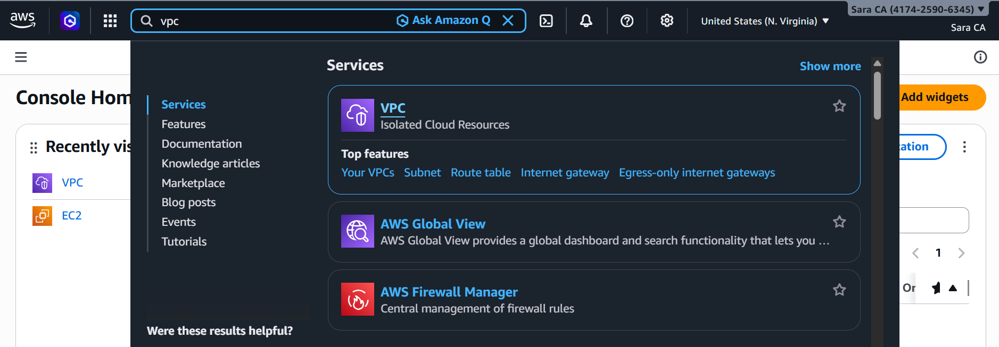

* **Seleccionar → Create VPC**

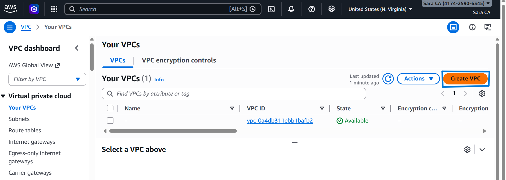

* **Configurar el Nombre de la VPC y un IPv4 CIDR (Ej: 10.0.0.0/16)**

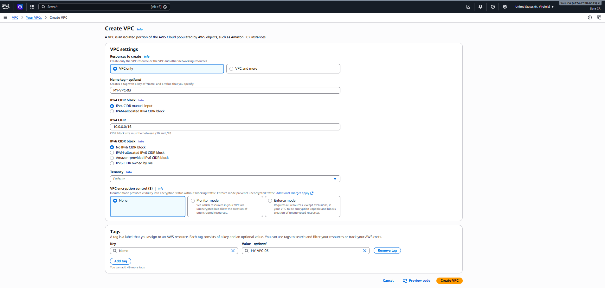
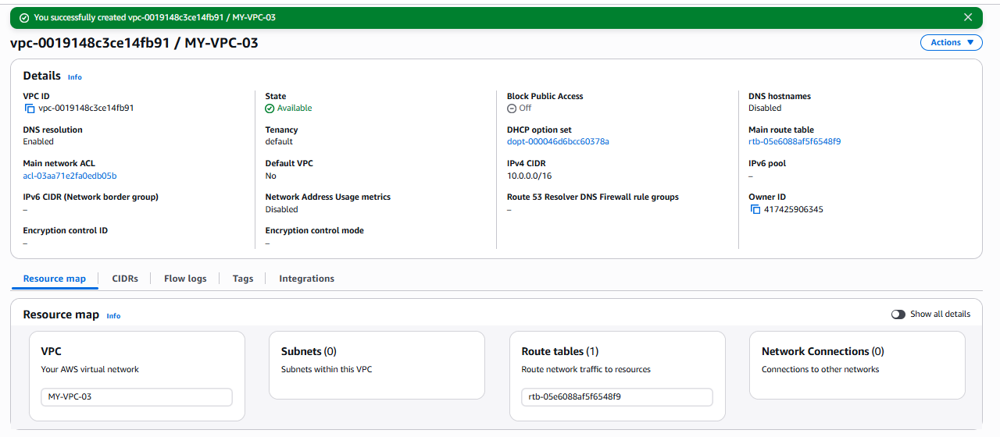

### 2. Crear las Subredes

Se realiza la creación de subredes y su configuración según el tipo de acceso.

* **En el menú lateral seleccionar → Subnets, Seleccionar → Create Subnet**

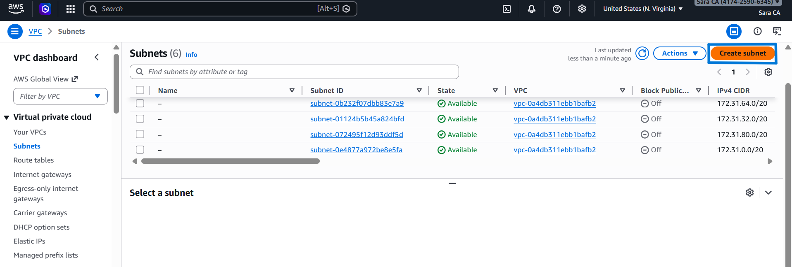

*  **Asociarla a la VPC Creada**

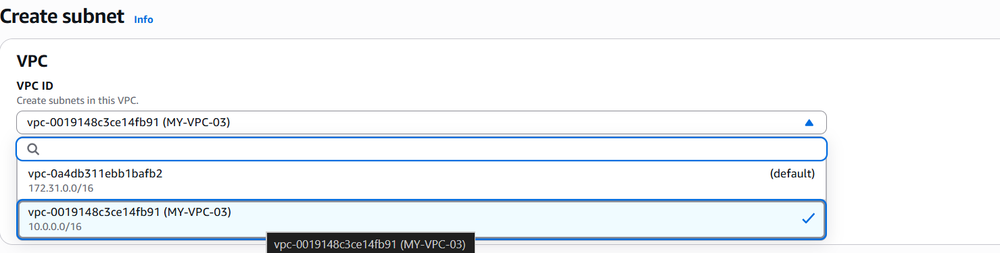

**2.1 Configuración de Subred Pública**

Configura el nombre de la Subred Pública y el IPv4 Subnet CIDR (Ej: 10.0.1.0/24)

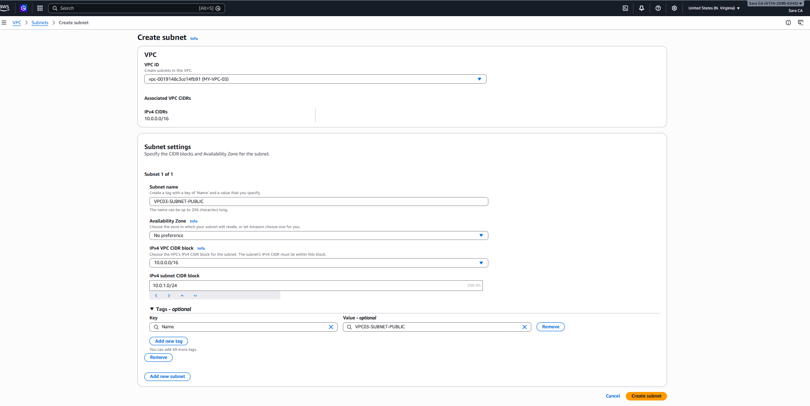

**2.1 Configuración de Subred Privada**

Configura el nombre de la Subred Privada y el IPv4 Subnet CIDR (Ej: 10.0.2.0/24)

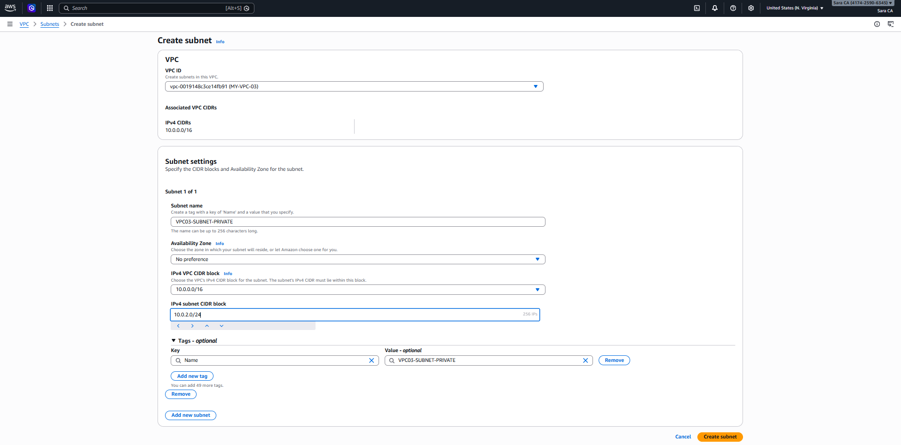

### 3. Configurar Internet Gateway

Se realiza la conexión con Internet

* **En el menú lateral seleccionar → Internet Gateways, Seleccionar → Create Internet Gateway**

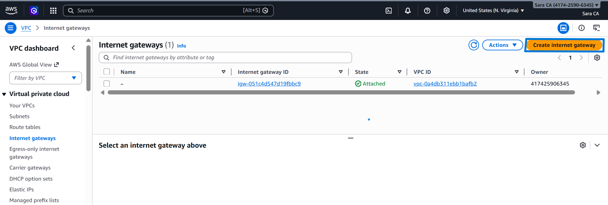

* **Asignar el Nombre y Crear**

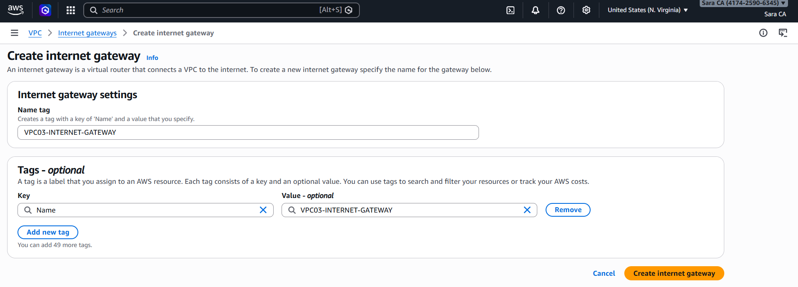

* **Seleccionar en el menú actions → Attach to VPC**

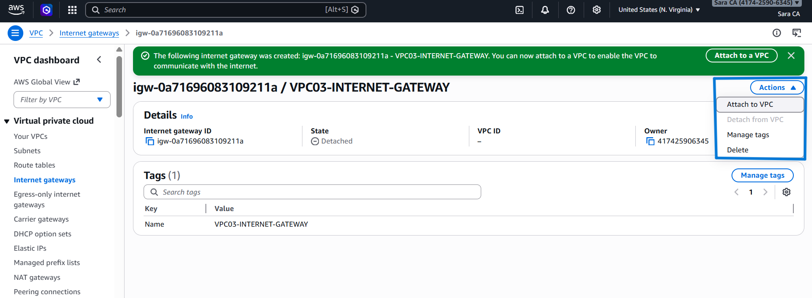

* **Attachment a la VPC creada**

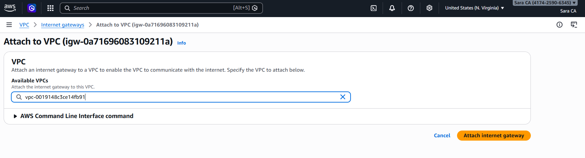

### 4. Cofigurar Route Table

Transformamos una subred común en una subred pública.

* **En el menú lateral seleccionar →  Route Tables, seleccionar → Create Route Table**

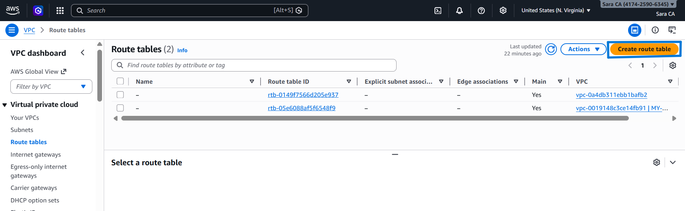

* **Configurar el Nombre de la ruta**

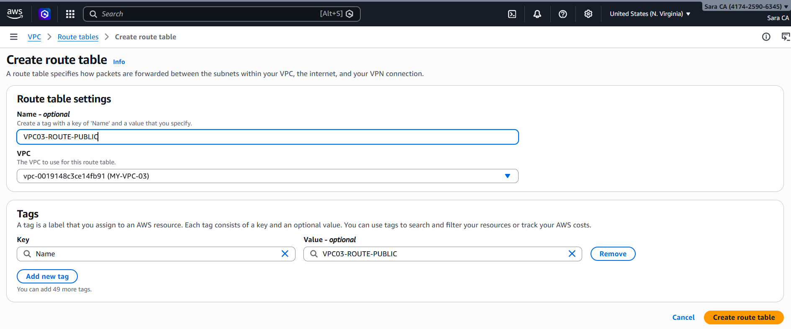

* **Seleccionar → Edit Route**

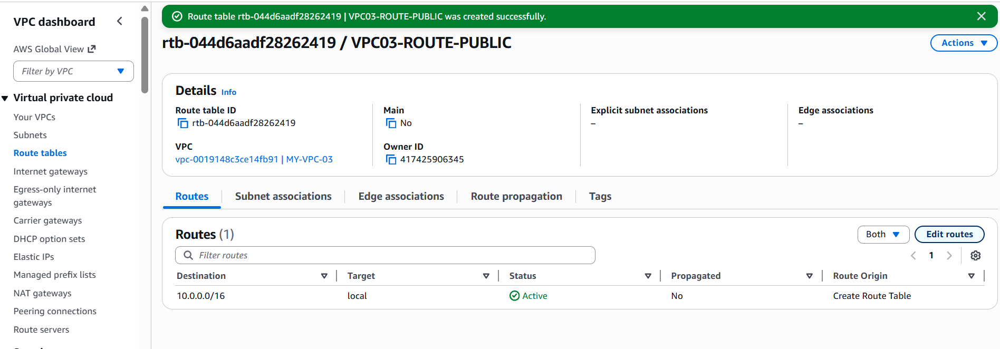

* **Seleccionar → Add Route**

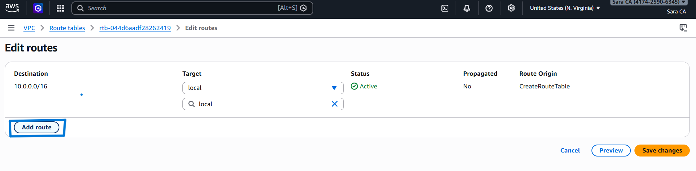

* **Añadir la ruta Destination: 0.0.0.0/0  y Conectarla con el Internet Gateway Creado previamente**

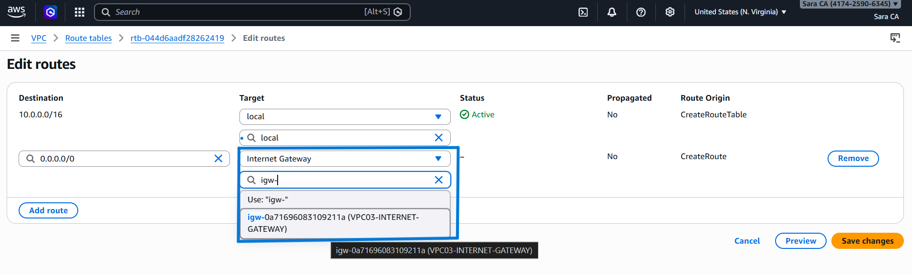

* **Asociación a la subnet publica: seleccionar actions → Edit Subnet associations**

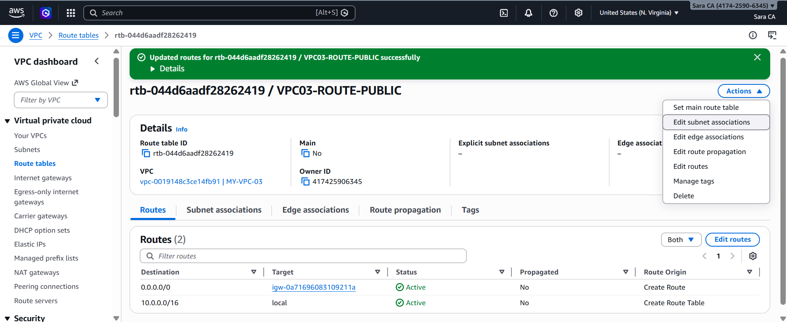

* **Attachment a la subnet pública**

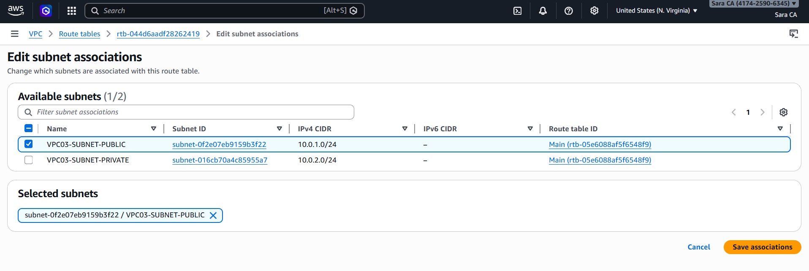

### Configurar Grupos de Seguridad (Security Groups)

* **En el menú lateral seleccionar → Security Groups, seleccionar → Create Security Group**

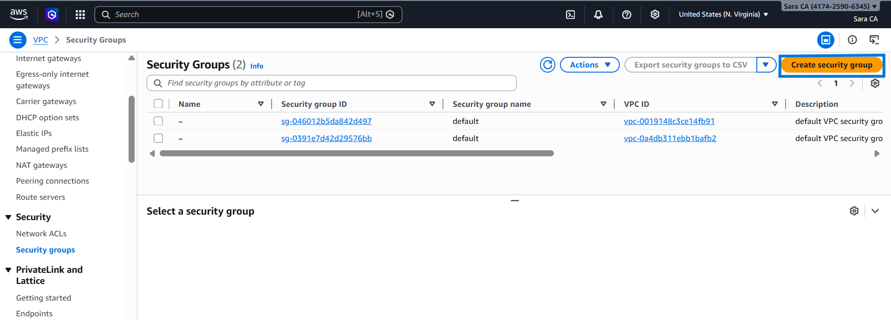

* **Configuración Nodo Master**

Inbound Rules (Reglas de entrada):

- Type: SSH
- Protocolo: TCP
- Puerto: 22
- Origin (Source): 0.0.0.0/0

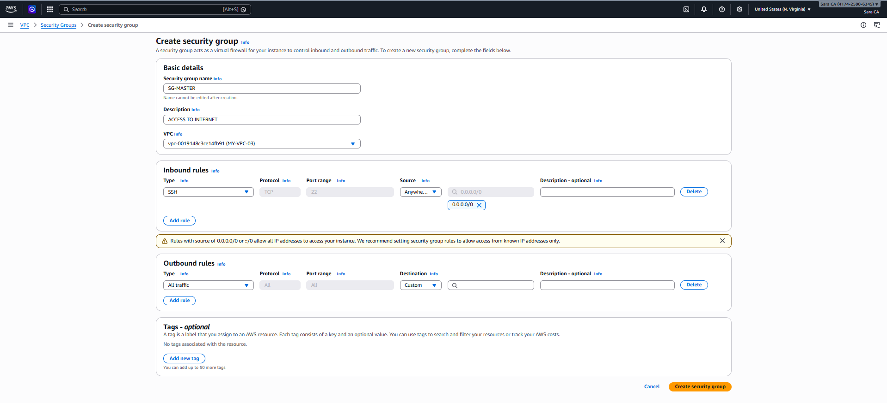

* **Configuración Nodo Worker**

Inbound Rules (Reglas de entrada):

- Type: SSH
- Protocolo: TCP
- Puerto: 22
- Origin (Source): SG-Master

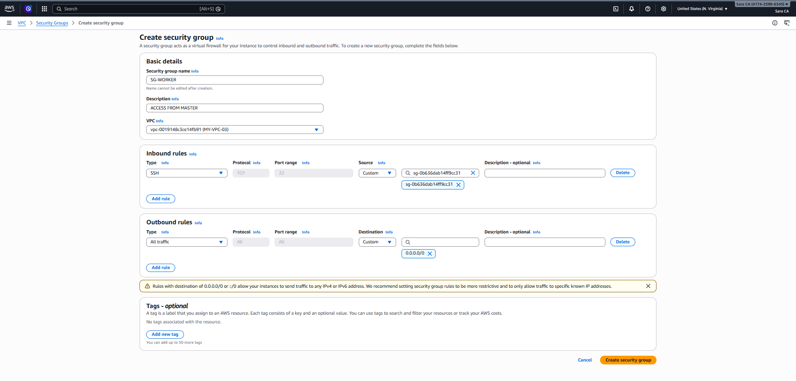

### ACLs de Red

En cuanto a la seguridad de red, la principal diferencia entre los Security Groups y las Network ACLs es que los Security Groups operan a nivel de instancia y son stateful (mantienen el estado de las conexiones), mientras que las Network ACLs operan a nivel de subred y son stateless (evalúan el tráfico de entrada y salida de forma independiente).